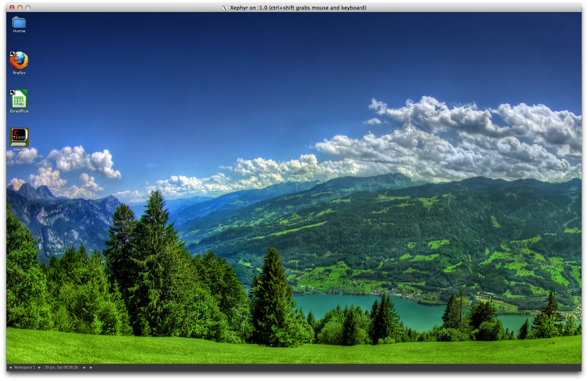

DOCKER-DESKTOP
==============

##Description

This Dockerfile creates a docker image and once it's executed it creates a container that runs X11 and SSH services.
The ssh is used to forward X11 and provide you encrypted data communication between the docker container and your local machine.

Xpra + Xephyr allows to display the applications running inside of the container such as Firefox, LibreOffice, xterm, etc. with recovery connection capabilities.

The applications can be rootless, so the client machine manages the windows that are displayed.

Fluxbox and ROX-Filer creates a very minimalist way to manages the windows and files. 




OBS: The client machine needs to have a X11 server installed (Xpra). See the "Notes" below. 

##Docker Installation

###On Linux:
Docker is available as a Ubuntu PPA (Personal Package Archive), hosted on launchpad which makes installing Docker on Ubuntu very easy.

```
#Add the PPA sources to your apt sources list.
sudo apt-get install python-software-properties && sudo add-apt-repository ppa:dotcloud/lxc-docker
 
# Update your sources
sudo apt-get update
 
# Install, you will see another warning that the package cannot be authenticated. Confirm install.
sudo apt-get install lxc-docker
```
###On Windows:
Requirements:
- Installation Tutorial (http://docs.docker.io/en/latest/installation/windows/)

###On Mac OS X:
Requirements:
- Installation Tutorial (http://docs.docker.io/en/latest/installation/vagrant/)

##Installation


###Building the docker image

```
$ docker build -t [username]/docker-desktop git://github.com/rogaha/docker-desktop.git
```

###Running the docker image created (-d: detached mode)

```
$ CONTAINER_ID=$(docker run -d [username]/docker-desktop)
```

###Getting the password generated during runtime

```
$ echo $(docker logs $CONTAINER_ID | sed -n 1p)
User: docker Password: xxxxxxxxxxxx
# where xxxxxxxxxxxx is the password created by PWGen that contains at least one capital letter and one number
```

##Usage

###Getting the container's external ssh port 

```
$ docker port $CONTAINER_ID 22
49153 # This is the external port that forwards to the ssh service running inside of the container as port 22
```

###Connecting to the container 

####Starting the a new session 

```
$ ifconfig | grep "inet addr:" 
inet addr:192.168.56.102  Bcast:192.168.56.255  Mask:255.255.255.0 # This is the LAN's IP for this machine

$ ssh docker@192.168.56.102 -p 49153 ./docker-desktop -s 800x600 -d 10 # Here is where we use the external port
docker@192.168.56.102's password: xxxxxxxxxxxx 

$ ./docker-desktop -h

-----------------------------------------------------------
Usage: docker-desktop [-s screen_size] [-d session_number]
-s : screen resolution (Default = 800x600
-d : session number (Default = 10)
-h : help
-----------------------------------------------------------
```

####Attaching to the session started

```
$ xpra --ssh="ssh -p 49153" attach ssh:docker@192.168.56.102:10 # user@ip_address:session_number
docker@192.168.56.102's password: xxxxxxxxxxxx 

```
If you want to execute programs rootles, you just need to connect to the container via ssh and type: 
DISPLAY=:[session_number] [program_name] & 

Eg. DISPLAY=:10 firefox &

##Notes

###On Windows:
Requirements:
- Xpra (https://www.xpra.org/dists/windows/)
- Path: C:\Program Files(x86)\Xpra\Xpra_cmd.exe

###On OS X:
Requirements:
- Xpra (https://www.xpra.org/dists/osx/x86/)
- Path: /Applications/Xpra.app/Contents/Helpers/xpra

###On Linux:
Requirements:
- Xpra: You can use apt-get to install it -> apt-get install xpra
- Path: /usr/bin/xpra
